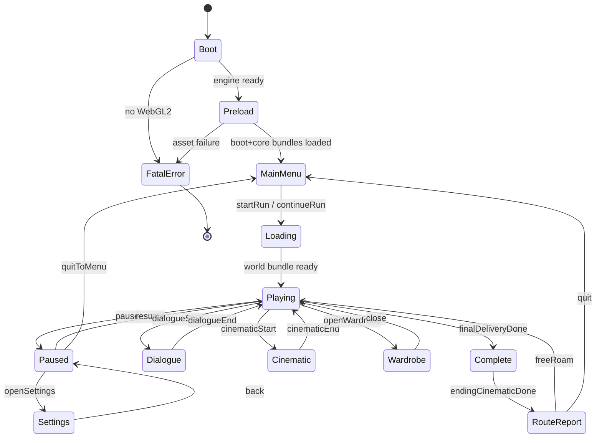
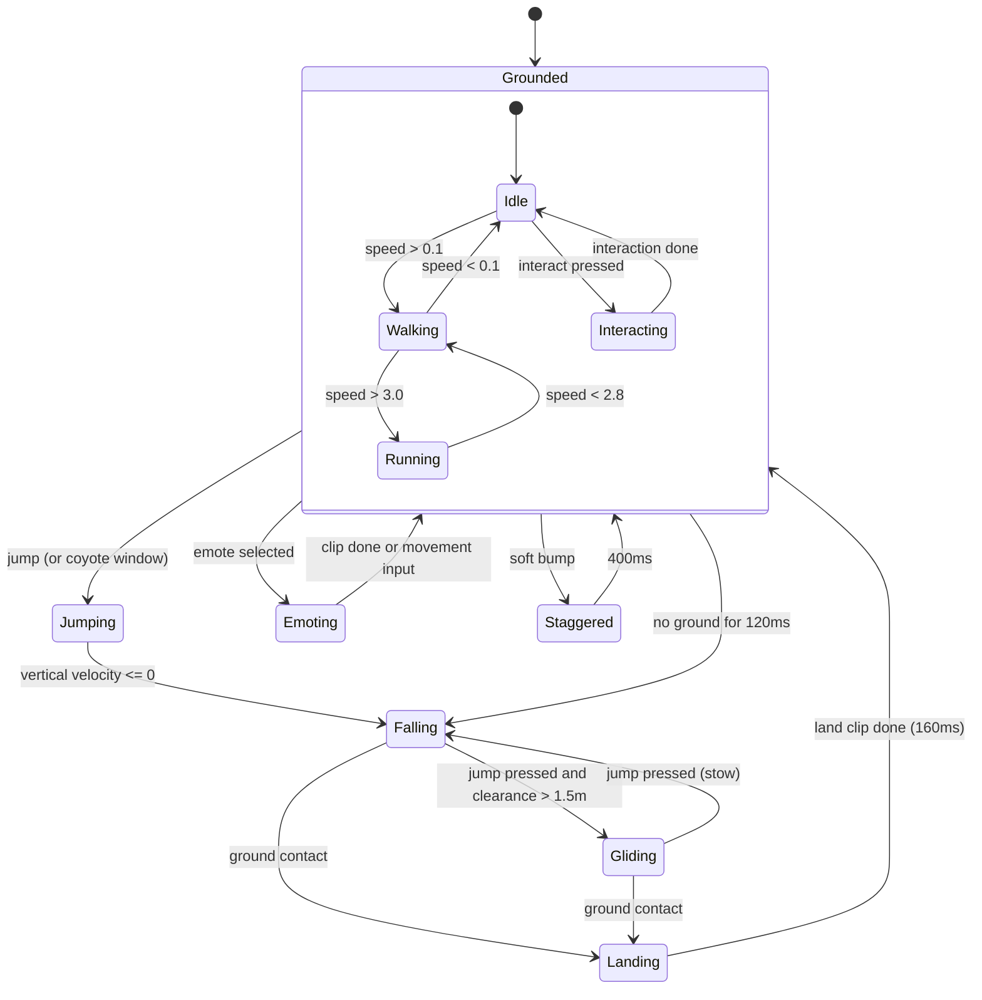
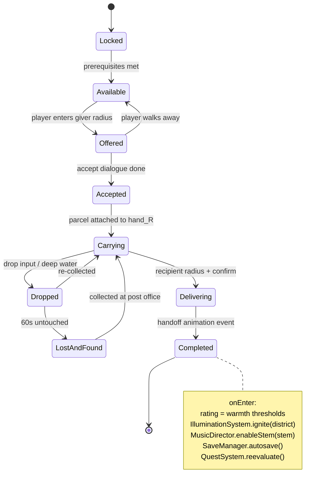

# 08 — State Machines

**Deliverable 7 of 12.** Three machines, all built on `core/fsm`. Each is a
table of `{ from, event, to, guard?, onEnter?, onExit? }` — transitions are data,
so illegal transitions are impossible rather than merely discouraged.

## 8.1 Global game state



**Notes.** `Paused`, `Dialogue`, `Cinematic` and `Wardrobe` all *suspend*
simulation but keep rendering — the world stays visible behind the overlay,
which is why `SceneManager` is a stack. `Complete` never unloads the world:
after the report the player returns to a fully lit planet for free roam and
shard hunting.

Suspension rules by state:

| State | fixedUpdate | update/render | Input map | Audio |
|---|---|---|---|---|
| `Playing` | ✅ | ✅ | `gameplay` | full |
| `Paused` | ❌ | ✅ (frozen) | `menu` | music ducked −12 dB, sfx muted |
| `Dialogue` | ❌ | ✅ (camera live) | `dialogue` | music ducked −6 dB |
| `Cinematic` | ❌ | ✅ | `cinematic` (skip only) | scripted |
| `Wardrobe` | ❌ | ✅ (portrait cam) | `menu` | ambience only |

## 8.2 Player character state machine



**Carry is a parallel layer, not a state.** `carrying: boolean` swaps the
locomotion clip set (`walk` → `carry_walk`) and applies the speed multiplier.
Modelling carry as its own state would double every node in this diagram — a
mistake worth calling out, because it is the obvious wrong first design.

Guards: `Gliding` requires `carrying !== 'heavy'` and clearance ≥ 1.5 m.
`Interacting` requires a valid focused interactable.

## 8.3 Delivery / contract state machine

Per contract, driven by `QuestSystem`:



There is no `Failed` state. That absence is a design commitment (GDD Pillar 2),
not an oversight — every path out of `Dropped` leads back to `Carrying`.

## 8.4 Illumination state (per district)

`Dark → Igniting (3.0 s) → Lit`. `Igniting` drives, in parallel: lamp emissive
0→1 (eased, staggered 40 ms per lamp for a cascade), district `saturation`
0.15→1.0, ambient tint lerp, music stem gain 0→1 over 2.5 s, dormant-NPC
enable at t=1.8 s, and a one-shot particle burst. On save load, districts
restore straight to `Lit` with no animation.

## 8.5 Implementation shape

```ts
export interface Transition<S extends string, E extends string, C> {
  from: S | S[];
  event: E;
  to: S;
  guard?: (ctx: C) => boolean;
  onExit?: (ctx: C) => void;
  onEnter?: (ctx: C) => void;
}

export class StateMachine<S extends string, E extends string, C> {
  constructor(initial: S, private ctx: C, private table: Transition<S, E, C>[]) {}
  send(event: E): boolean;      // false if no legal transition — never throws
  get current(): S;
  can(event: E): boolean;
  onTransition(cb: (from: S, to: S, event: E) => void): Unsubscribe;
}
```

Every transition emits `state:changed` on the `EventBus`, which is how the UI,
audio and analytics layers stay decoupled from the machines themselves. All
three machines are unit-tested without a renderer.
