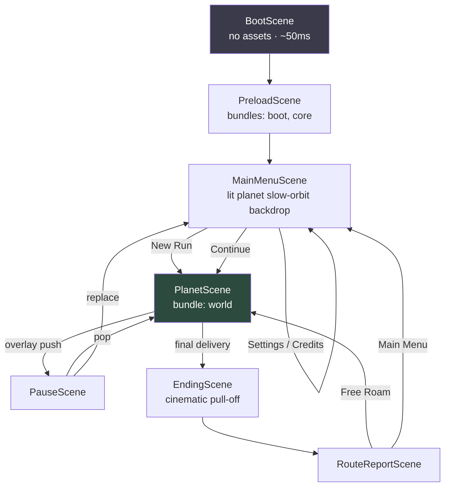

# 09 — Scene Flow

**Deliverable 8 of 12.**

## 9.1 Scene graph



## 9.2 Scene responsibilities

| Scene | Bundles | Owns | Notes |
|---|---|---|---|
| `BootScene` | — | WebGL2 capability check, quality-tier detection, save load, locale pick | No 3D. Fails to `FatalError` with a readable message if WebGL2 is missing |
| `PreloadScene` | `boot`, `core` | Progress bar, brand animation, first-gesture audio unlock | The CSS/SVG loading art renders before any asset loads — the player sees something in < 300 ms |
| `MainMenuScene` | `core` | Menu UI, slow-orbiting lit planet backdrop, menu music | The backdrop reuses the real planet mesh at low LOD — no separate art, and it previews the reward state |
| `PlanetScene` | `world` (+ streams `audio_*`) | The game. Player, NPCs, quests, camera director, illumination, HUD | The only simulating scene |
| `PauseScene` | — | Pause menu, settings, quit confirm | **Overlay** — pushed, never replaces; `PlanetScene` stays loaded and rendered frozen |
| `EndingScene` | — | Finale cinematic, camera pull-off, `mus_finale` | Reuses `PlanetScene`'s world; only the camera and input map change |
| `RouteReportScene` | — | Score, ratings, shard count, personal best, share | Overlay over the lit planet |

## 9.3 Lifecycle contract

```ts
export interface IScene {
  readonly id: SceneId;
  readonly assetBundles: string[];
  readonly overlay?: boolean;          // true → push over, don't unload below

  preload(onProgress: (p: number) => void): Promise<void>;
  onEnter(params?: SceneParams): Promise<void>;
  fixedUpdate(dt: number): void;
  update(dt: number): void;
  lateUpdate(dt: number): void;
  onExit(): Promise<void>;
  dispose(): void;                     // release bundles, dispose GPU resources
}
```

`SceneManager.replace(next)` sequence:

```
1. transition.out()                    450ms lumen iris wipe
2. current.onExit()                    save, stop audio, detach input
3. assets.acquire(next.assetBundles)   ref-count up; already-held bundles are free
4. next.preload(onProgress)            loading UI if > 250ms, else skipped entirely
5. current.dispose()                   only after next is ready — no blank frame
6. assets.release(prev.assetBundles)   ref-count down; dispose at zero
7. next.onEnter(params)
8. transition.in()
```

Disposing the outgoing scene *after* the incoming one is ready costs a little
peak memory and buys a seamless transition. On a 15 MB game that is the right
trade; it is called out here so it does not get "optimised" away later.

## 9.4 Transitions

| Transition | Effect | Duration |
|---|---|---|
| Preload → MainMenu | Logo settles, planet fades up, music in | 800 ms |
| MainMenu → Planet | Lumen iris wipe + camera dive to the surface | 1200 ms |
| Playing → Paused | Blur backdrop 0→8 px, desaturate 30%, menu slides up | 220 ms |
| Playing → Dialogue | Camera eases to two-shot, HUD fades out, card slides up | 400 ms |
| District ignition | Not a scene transition — an in-world effect | 3000 ms |
| Playing → Ending | Camera unlocks, pulls off the surface | 6000 ms |
| Ending → Report | Cross-fade to report over the turning planet | 900 ms |

All easings come from `ui/theme/motion.css` so DOM and WebGL transitions share
one curve set. Everything respects `prefers-reduced-motion`: wipes become
cross-fades, camera moves shorten, parallax and shake are disabled.

## 9.5 First-load timeline (target, mid-range mobile on 4G)

```
0.0s  HTML + critical CSS      → brand mark visible
0.3s  boot JS parsed           → loading screen animating
1.4s  core bundle              → progress 60%
2.8s  world bundle             → progress 100%
3.1s  MainMenuScene            → planet orbiting, music on first gesture
3.4s  player presses Start
4.6s  PlanetScene              → playable
```

Time-to-interactive ≤ 5 s on mobile, ≤ 3 s on desktop. This is a hard
requirement, not a goal — it is the product's main distribution advantage.
