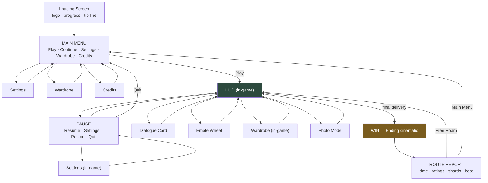

# 10 — UI Architecture & Flow

**Deliverable 9 of 12.**

## 10.1 UI flow



> **On a "Lose Screen":** the main game has no fail state (GDD §2.6), so there
> is no lose screen in v1. The screen is *designed and built* — same layout as
> the Route Report with a "Storm Run ended" header and a Retry action — and
> lives behind the `GameMode` seam for Phase 7's Storm Run. Building the
> component now costs an hour; retrofitting it later costs a refactor.

## 10.2 Screen inventory

### Loading Screen
Brand mark (animated SVG, renders before WebGL), determinate byte-weighted
progress bar, rotating single-line tips, version string. Minimum display 600 ms
so it never flashes. If loading exceeds 12 s, a "still working — slow
connection" line appears rather than leaving the player guessing.

### Main Menu
Full-bleed 3D backdrop: the lit planet slowly orbiting (previews the reward).
Left-aligned vertical menu, large type. **Continue** is primary and shows
`Contract 3 of 5 · Bramblewood`; **New Run** is secondary and confirms if it
would overwrite. Bottom bar: audio toggle, fullscreen, language, credits.

### HUD (deliberately sparse — Pillar 3)
| Element | Position | Behaviour |
|---|---|---|
| Compass ribbon | Top centre | Bearing chevron + distance band. Fades to 25% when idle 8 s |
| Contract card | Top left | Recipient name + one-line hint. Collapses to an icon after 10 s, expands on new contract |
| Prompt chip | World-space, above target | Scale-pops in; shows the glyph for the active input device |
| Parcel indicator | Bottom left | The parcel itself, tinted by warmth. **No numeric meter** |
| Emote + Wardrobe buttons | Bottom right | Mirrors the reference's affordance placement |
| Touch controls | Bottom left/right | Floating joystick + jump/interact; touch devices only |
| Toasts | Top right | "Lumen Shard 7/24", auto-dismiss 2.5 s, max 3 stacked |

Everything except the toast layer hides in Photo Mode and during cinematics.

### Pause Menu
Backdrop blur + desaturate over the frozen world. Resume · Settings · Restart
Contract · Quit to Menu, plus run stats (time, contracts, shards). Esc, Start
and the Pause button all toggle it. Focus is trapped; Esc backs out one level.

### Settings (tabbed; identical component in-menu and in-game)
| Tab | Contents |
|---|---|
| Audio | Master, Music, SFX, Ambience sliders; mute-on-blur toggle |
| Video | Quality tier (Auto/Low/Med/High), resolution scale, shadows, bloom, outline, FOV, motion blur off |
| Controls | Rebindable keys, gamepad layout, invert Y, sensitivity, hold-vs-toggle run, joystick side |
| Accessibility | UI scale, subtitle size + background, reduce motion, camera shake, colour-blind marker mode, high-contrast prompts, auto-run |
| Game | Language, invert compass, tips on/off, reset progress (double-confirm) |

Every change applies live and persists immediately through `SettingsManager`.

### Wardrobe
Character on a turntable with a rim light. Four slot tabs (hair, top, bottom,
shoes); locked items show their unlock condition. Cosmetics bundle loads on
first open (~1.4 MB), with a spinner on the grid, never blocking the scene.

### Win Screen / Route Report
Ending cinematic (camera pulls off the lit planet, full score playing), then the
report: total time, per-contract rating pips (Bright/Warm/Cool), districts lit
5/5, shards found n/24, personal best delta, and Free Roam / Share / Main Menu.
Animated counters stagger in over 1.2 s.

### Dialogue
Bottom-anchored card, speaker name + portrait, 2–3 lines max, typewriter reveal
at 45 chars/s with pitched blips, tap/Space to complete-then-advance. Choices
render as up to 3 buttons. Skippable, and the skip is not hidden.

## 10.3 UI architecture

```
DOM overlay (position: fixed, inset: 0, pointer-events: none)
 └── <ui-root>                       pointer-events: auto on interactive children
      ├── <ui-screen-stack>          modal screens (menu, pause, settings…)
      ├── <ui-hud-layer>             gameplay HUD
      ├── <ui-world-anchors>         DOM elements positioned by projecting
      │                              world coords to screen each frame
      ├── <ui-toast-layer>
      └── <ui-transition-layer>      wipes, fades, vignette
```

**Rules**

1. **One-way data flow.** `GameState` → (read-only projection) → components.
   Components emit intents on the `EventBus`; they never write game state.
2. **Screens are a stack** with focus trapping and Esc-to-back, mirroring
   `SceneManager` so UI and scene state can never desynchronise.
3. **World anchors** are DOM nodes driven by `project(worldPos, camera)` in
   `lateUpdate`, using `transform: translate3d()` only — no layout thrash. Nodes
   behind the camera or below the horizon are `visibility: hidden`, not removed.
4. **Design tokens in CSS custom properties** (`ui/theme/tokens.css`): colour,
   spacing (4 px scale), radii, elevation, motion curves, type ramp. Restyling
   the game is one file.
5. **Input glyphs are reactive.** `input:deviceChanged` re-renders every prompt,
   so a player who picks up a gamepad mid-run sees console glyphs immediately.

## 10.4 Responsive layout

| Breakpoint | Layout |
|---|---|
| ≥ 1280 px | Full HUD, menus in a 480 px left column, generous margins |
| 768–1279 px | Compact HUD, centred menus |
| < 768 px landscape | Touch controls on, HUD to corners, larger hit targets |
| < 768 px portrait | Vertical HUD, compass to top, controls to lower third, menus full-width sheets |

- All spacing in `rem` against a root font size that scales with viewport,
  clamped: `clamp(14px, 0.9vw + 10px, 20px)`.
- Safe areas via `env(safe-area-inset-*)` on every edge-anchored element —
  notches and home indicators.
- Minimum touch target 48×48 px, minimum 8 px between targets.
- `visualViewport` listener handles mobile URL-bar collapse (`window.resize`
  alone gets this wrong and leaves the HUD under the browser chrome).
- Menus are keyboard- and gamepad-navigable via spatial focus, with a visible
  focus ring that is never removed.

## 10.5 Visual direction

Warm, soft, low-contrast-but-legible. Rounded 16 px radii, soft shadows, frosted
translucency over the world. Type: a friendly geometric sans for display, a
highly legible humanist sans for body. Palette derives from the current
illumination state — the UI literally warms up as the planet lights, which ties
the interface to Pillar 1 instead of floating above it.

## 10.6 Accessibility commitments

WCAG AA contrast on all text; subtitles on by default with adjustable size and
an opaque backing; full keyboard and gamepad navigation; screen-reader labels on
every control; `prefers-reduced-motion` honoured across DOM *and* camera;
colour-blind-safe objective markers (shape + colour, never colour alone); no
information conveyed by audio alone; no flashing above 3 Hz.
