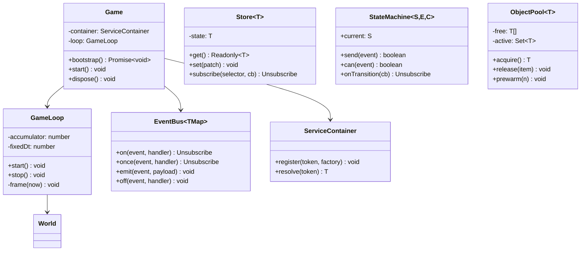
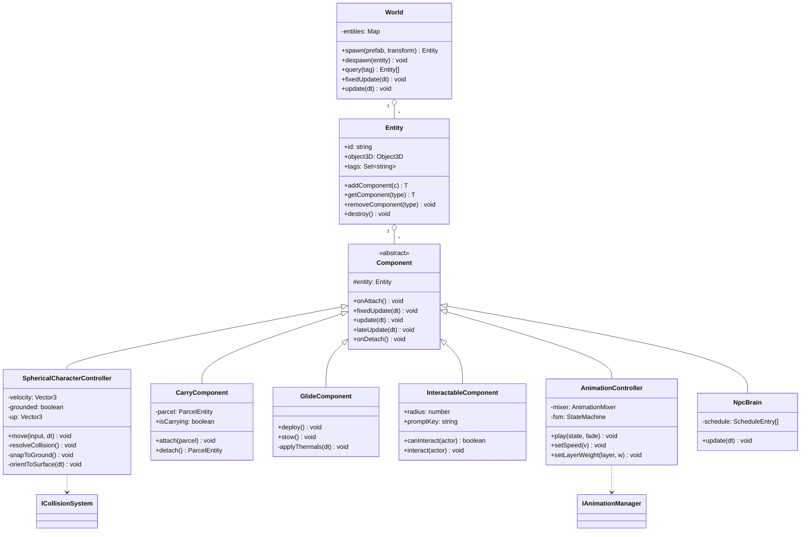
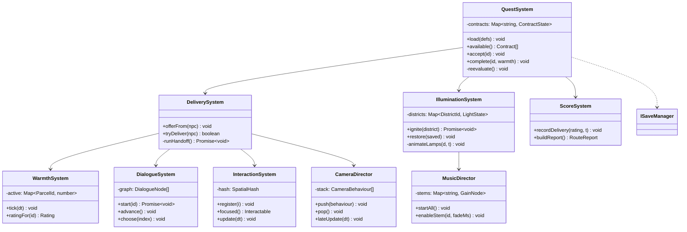
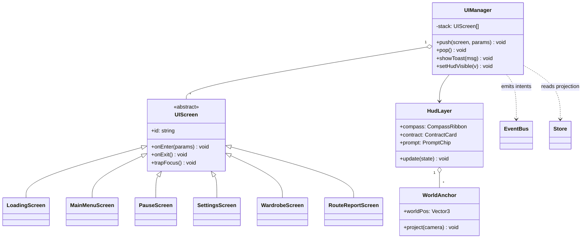

# 11 — Class Diagram

**Deliverable 10 of 12.** Split into four views to stay readable.

## 11.1 Core & engine services

```mermaid
classDiagram
    class ISceneManager {
        <<interface>>
        +push(scene, params) Promise~void~
        +pop() Promise~void~
        +replace(scene, params) Promise~void~
        +current() IScene
    }
    class IAssetManager {
        <<interface>>
        +acquire(bundle) Promise~void~
        +release(bundle) void
        +get(id) T
        +progress() number
    }
    class IAudioManager {
        <<interface>>
        +playSfx(id, opts) VoiceHandle
        +playAt(id, position) VoiceHandle
        +setBusVolume(bus, v) void
        +music() MusicDirector
    }
    class IInputManager {
        <<interface>>
        +getAxis2D(action) Vec2
        +isDown(action) boolean
        +wasPressed(action) boolean
        +setActionMap(id) void
        +activeDevice() DeviceKind
    }
    class ICollisionSystem {
        <<interface>>
        +buildWorld(meshes) void
        +moveCapsule(capsule, delta) MoveResult
        +raycast(origin, dir, maxDist) HitResult
        +queryNear(pos, radius) Interactable[]
    }
    class ISaveManager {
        <<interface>>
        +load() SaveData
        +save(data) void
        +autosave() void
        +reset() void
    }
    class IAnimationManager {
        <<interface>>
        +createController(entity, manifest) AnimationController
        +update(dt) void
    }

    class SceneManager
    class AssetManager
    class AudioManager
    class InputManager
    class BvhCollisionSystem
    class SaveManager
    class AnimationManager

    ISceneManager <|.. SceneManager
    IAssetManager <|.. AssetManager
    IAudioManager <|.. AudioManager
    IInputManager <|.. InputManager
    ICollisionSystem <|.. BvhCollisionSystem
    ISaveManager <|.. SaveManager
    IAnimationManager <|.. AnimationManager
```

Every subsystem is consumed through its interface and resolved from the
container. That is what lets `QuestSystem` be unit-tested with a fake
`IAudioManager` and no GPU — the practical payoff of the D in SOLID.

## 11.2 Entity & component model

## 11.3 Gameplay systems

Systems talk to each other through the `EventBus` wherever the arrow would
otherwise create a cycle. The arrows above are *direct* calls only, and the
graph is acyclic by construction — a rule worth enforcing in review.

## 11.4 UI layer

