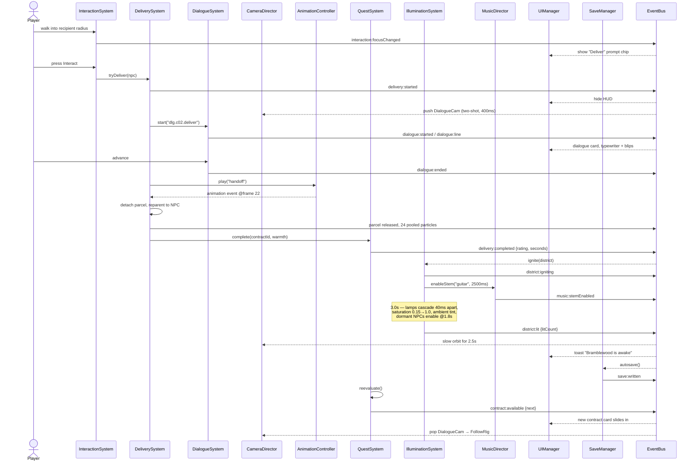

# 12 — Event Flow

**Deliverable 11 of 12.** One typed bus. Systems never reach into each other's
internals; if two systems need to coordinate and a direct call would create a
cycle, they use an event.

## 12.1 The typed event contract

`core/events/EventMap.ts` is the single source of truth. Adding an event without
declaring it here is a type error, and every handler is checked against its
payload:

```ts
export interface EventMap {
  // ── engine ──────────────────────────────────────────────────────
  'engine:ready':            void;
  'engine:contextLost':      void;
  'engine:contextRestored':  void;
  'asset:progress':          { bundle: string; loaded: number; total: number };
  'asset:bundleReady':       { bundle: string };
  'asset:error':             { bundle: string; url: string; error: Error };
  'scene:willEnter':         { id: SceneId };
  'scene:entered':           { id: SceneId };
  'scene:willExit':          { id: SceneId };
  'input:deviceChanged':     { device: 'keyboard' | 'gamepad' | 'touch' };
  'viewport:resized':        { w: number; h: number; dpr: number; portrait: boolean };
  'quality:changed':         { tier: QualityTier; reason: 'auto' | 'user' };

  // ── game state ──────────────────────────────────────────────────
  'state:changed':           { from: GameState; to: GameState };
  'game:started':            { isNewRun: boolean };
  'game:paused':             void;
  'game:resumed':            void;
  'game:completed':          { report: RouteReport };

  // ── player ──────────────────────────────────────────────────────
  'player:spawned':          { entityId: string };
  'player:stateChanged':     { from: PlayerState; to: PlayerState };
  'player:landed':           { impactSpeed: number; surface: SurfaceType };
  'player:footstep':         { surface: SurfaceType; position: Vector3 };
  'player:glideStarted':     void;
  'player:glideEnded':       { airtime: number };
  'player:enteredDistrict':  { district: DistrictId };

  // ── delivery ────────────────────────────────────────────────────
  'contract:available':      { id: string };
  'contract:offered':        { id: string; giver: string };
  'contract:accepted':       { id: string };
  'parcel:picked':           { parcelId: string; weight: ParcelWeight };
  'parcel:dropped':          { parcelId: string; position: Vector3 };
  'parcel:warmthChanged':    { parcelId: string; warmth: number };
  'delivery:started':        { contractId: string; recipient: string };
  'delivery:completed':      { contractId: string; rating: Rating; seconds: number };

  // ── world ───────────────────────────────────────────────────────
  'district:igniting':       { district: DistrictId };
  'district:lit':            { district: DistrictId; litCount: number };
  'shard:collected':         { id: string; total: number; of: number };
  'music:stemEnabled':       { stem: string };

  // ── interaction & dialogue ──────────────────────────────────────
  'interaction:focusChanged':{ id: string | null; promptKey: string | null };
  'dialogue:started':        { nodeId: string; speaker: string };
  'dialogue:line':           { text: string; speaker: string };
  'dialogue:ended':          { nodeId: string };

  // ── ui intents (UI → game; the ONLY direction UI may push) ──────
  'ui:requestStart':         { newRun: boolean };
  'ui:requestPause':         void;
  'ui:requestResume':        void;
  'ui:requestQuit':          void;
  'ui:requestInteract':      void;
  'ui:requestEmote':         { emoteId: string };
  'ui:settingChanged':       { key: SettingKey; value: unknown };

  // ── persistence ─────────────────────────────────────────────────
  'save:written':            { bytes: number };
  'save:corrupt':            { backupKey: string };
}
```

Naming: `domain:pastTenseFact` for things that happened, `ui:requestX` for
intents. Handlers must be side-effect-safe and must not emit synchronously into
the same event (the bus asserts on re-entrancy in dev builds).

## 12.2 The central sequence — a completed delivery

This is the moment the whole game exists to produce, and it shows why the bus
matters: eight systems react to one fact, none of them knowing about each other.



Adding a ninth reaction — analytics, an achievement, a Steam-style toast — is a
new subscriber and nothing else. That is the test of whether this design works.

## 12.3 Frame-level ordering

Order matters more than it looks. Camera reads transforms, so it must run after
them; UI anchors project from the camera, so they run after the camera.

```
requestAnimationFrame
 ├─ input.beginFrame()                  poll devices, compute edges
 ├─ while (accumulator >= 1/60)         FIXED
 │   ├─ InputManager.sampleFixed()
 │   ├─ SphericalCharacterController.fixedUpdate()   move + collide + orient
 │   ├─ NpcBrain.fixedUpdate()
 │   ├─ CollisionSystem.updateTriggers()
 │   ├─ InteractionSystem.fixedUpdate()  focus candidate scoring
 │   ├─ WarmthSystem.tick()
 │   └─ QuestSystem.fixedUpdate()
 ├─ world.update(frameTime)             VARIABLE
 │   ├─ AnimationManager.update()        mixers, blend weights
 │   ├─ IlluminationSystem.update()      lamp/saturation lerps
 │   ├─ ParticleSystem.update()          pooled, instanced
 │   └─ VfxSystem.update()
 ├─ world.interpolate(alpha)            smooth render transforms
 ├─ world.lateUpdate(frameTime)
 │   ├─ CameraDirector.lateUpdate()      spring follow, occlusion, blends
 │   └─ UIManager.updateWorldAnchors()   project to screen
 ├─ HorizonCuller.cull()                 one dot product per object
 ├─ renderer.render()                    shadow → opaque → outline → transparent → post
 └─ input.endFrame()                     roll edge state
```

## 12.4 Reliability paths

| Event | Handling |
|---|---|
| `engine:contextLost` | Freeze the loop, show a "restoring graphics" overlay, `preventDefault()` the browser event so restore is possible |
| `engine:contextRestored` | Rebuild GPU resources from the asset cache, restore scene state, resume — the player keeps their progress |
| `asset:error` | Retry twice with backoff; on final failure fall back to the placeholder asset and log. A missing prop must never be a black screen |
| `save:corrupt` | Back up under a timestamped key, start fresh, tell the player plainly what happened |
| `visibilitychange` (hidden) | Pause simulation, duck audio to silence, stop rAF — no battery burn in a background tab |
| Tab hidden > 30 min | Autosave and return to the main menu on restore rather than resuming a stale session |
